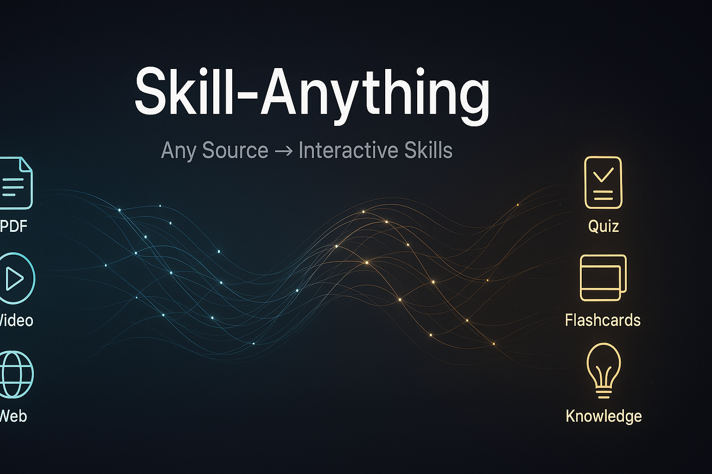

<p align="center">
  
</p>

<p align="center">
  <a href="LICENSE"></a>
  <a href="https://www.python.org"></a>
  <a href="#output-structure"></a>
  <a href="#quiz-types"></a>
</p>

<p align="center">
  <a href="#quick-start">Quick Start</a> •
  <a href="#demo">Demo</a> •
  <a href="#output-structure">Output</a> •
  <a href="#skill-export">Skill Export</a> •
  <a href="#environment-variables">Config</a> •
  <a href="#cli-reference">CLI</a> •
  <a href="#python-api">API</a> •
  <a href="#faq">FAQ</a>
</p>

---

## Why Skill-Anything?

AI agents are getting smarter, but **humans still learn the same broken way** — read, forget, re-read, forget again. Research shows passive reading retains ~10% of information, while active recall (quizzes, flashcards, spaced repetition) pushes retention to 80%+. Creating those materials manually? Nobody has time.

**Skill-Anything automates the entire pipeline.** One command. Any source. Production-ready learning package.

| Pain Point | How Skill-Anything Solves It |
|:-----------|:-----------------------------|
| **Passive reading** — read once, forget in a week | 12-section study guide auto-generated with structured notes, cheat sheet, and concept map |
| **No active recall** — no quizzes, no testing | 6 quiz types (MCQ, scenario, comparison, ...) with detailed explanations and A-F grading |
| **No spaced repetition** — no flashcards, no review schedule | Auto-generated flashcards with multi-round CLI review mode |
| **Manual note-taking** — hours of summarizing | AI-powered knowledge extraction — glossary, key concepts, takeaways in seconds |
| **No learning path** — what to study next? | Prerequisites + next steps + recommended resources auto-generated |
| **Source-locked** — knowledge stuck in one format | Any source → structured YAML — reusable across tools and workflows |

---

## Demo

<p align="center">
  
</p>

<p align="center">
  <b><a href="https://syuan03.github.io/Skill-Anything/assets/demo.html">▶ Open Interactive Demo (GitHub Pages)</a></b>
  <br/>
  <sub>Full interactive demo with generation pipeline animation, quiz session, and output explorer.</sub>
</p>

The demo showcases:

- **Generation Pipeline** — `sa auto transformer-paper.pdf` extracts, generates, and outputs a complete skill pack
- **Interactive Quiz** — Hard-difficulty quiz with scenario, comparison, and fill-in-the-blank questions
- **Output Explorer** — Browse the 12-section study guide, key concepts, glossary, flashcards, and exercises

<details><summary><b>Run the interactive demo locally</b></summary>

```bash
git clone https://github.com/Skill-Anything/Skill-Anything.git
open Skill-Anything/assets/demo.html      # macOS
xdg-open Skill-Anything/assets/demo.html  # Linux
```

</details>

---

## Quick Start

### 1. Install

```bash
pip install skill-anything[all]
```

<details><summary><b>From source (development)</b></summary>

```bash
git clone https://github.com/Skill-Anything/Skill-Anything.git
cd Skill-Anything
pip install -e ".[all,dev]"
```

</details>

<details><summary><b>Minimal install (choose only what you need)</b></summary>

```bash
pip install skill-anything            # core only (text source)
pip install skill-anything[pdf]       # + PDF support (pdfplumber)
pip install skill-anything[video]     # + video support (youtube-transcript-api)
pip install skill-anything[web]       # + web support (beautifulsoup4)
pip install skill-anything[all]       # everything
```

</details>

### 2. Configure LLM

```bash
cp .env.example .env
# Edit .env — set your API key and model
```

Skill-Anything works with **any OpenAI-compatible API**:

| Provider | `API_BASE` | Example Model |
|:---------|:-----------|:-------------|
| OpenAI | `https://api.openai.com/v1` | `gpt-4o` |
| DeepSeek | `https://api.deepseek.com/v1` | `deepseek-chat` |
| Qwen (Dashscope) | `https://dashscope.aliyuncs.com/compatible-mode/v1` | `qwen-max` |
| Ollama (local) | `http://localhost:11434/v1` | `llama3` |
| Any compatible API | Just set the base URL | — |

> **No API key?** Skill-Anything still works — it falls back to rule-based generation. All features function, just with lower quality.

### 3. Generate a Skill Pack

```bash
sa pdf textbook.pdf                                    # PDF → Skill
sa video https://www.youtube.com/watch?v=dQw4w9WgXcQ   # Video → Skill
sa web https://example.com/article                     # Webpage → Skill
sa text notes.md                                       # Text → Skill
sa auto anything                                       # Auto-detect source type
```

### 4. Learn Interactively

```bash
sa quiz output/my-skill.yaml       # Take an interactive quiz (6 types, graded A-F)
sa review output/my-skill.yaml     # Flashcard review (multi-round spaced repetition)
sa info output/my-skill.yaml       # View full skill pack details
```

---

## Output Structure

Every source generates **3 output files** by default (study format), or a **SKILL.md directory** (skill format):

### Study Format (default)

```
output/
├── my-skill.yaml              # Structured data (quiz/review/info commands use this)
├── my-skill.md                # Complete study guide (12 sections, read directly)
└── my-skill-concept-map.png   # AI-generated visual concept map
```

### Skill Format (`--format skill`)

```
output/my-skill/
├── SKILL.md                   # Claude Code / Cursor / Codex compatible
├── references/                # Detailed notes, glossary, learning path
├── assets/                    # Quiz, flashcards, exercises (YAML), concept map
└── scripts/                   # Standalone quiz runner
```

> Use `--format all` to generate both formats at once.

### The 12-Section Study Guide

The `.md` file is a self-contained learning package:

| # | Section | Description |
|:-:|:--------|:------------|
| 1 | **Summary** | Core thesis, methodology, and conclusions — not a surface-level rehash |
| 2 | **Concept Map** | AI-generated visual diagram showing how concepts relate |
| 3 | **Outline** | Timestamped structure (video), page map (PDF), or section breakdown (text) |
| 4 | **Detailed Notes** | Hierarchical, thorough notes — read these instead of the source |
| 5 | **Key Concepts** | 10-15 core ideas, ordered foundational → advanced |
| 6 | **Glossary** | 15-25 domain terms with precise definitions + cross-references |
| 7 | **Cheat Sheet** | One-page quick reference — print it, pin it to your wall |
| 8 | **Takeaways** | Actionable next steps — what to *do* with this knowledge |
| 9 | **Quiz** | 20-40 questions across 6 cognitive levels |
| 10 | **Flashcards** | 25-50 spaced-repetition cards for long-term retention |
| 11 | **Exercises** | Hands-on tasks: analysis, design, implementation, critique |
| 12 | **Learning Path** | Prerequisites + next steps + recommended books, courses, and tools |

### YAML Data Format

The `.yaml` file contains the full structured data, consumable by `sa quiz`, `sa review`, `sa info`, or any downstream tool:

```yaml
 title: "Transformer Learning Pack"
source_type: pdf
source_ref: "transformer-paper.pdf"
summary: "..."
detailed_notes: "..."
key_concepts:
  - "Self-attention mechanism"
  - "Multi-head attention"
  - ...
glossary:
  - term: "Attention"
    definition: "A mechanism that computes relevance weights..."
    related_terms: ["Self-Attention", "Cross-Attention"]
  - ...
quiz_questions:
  - question: "What is the purpose of positional encoding?"
    options: ["A) ...", "B) ...", "C) ...", "D) ..."]
    answer: "B) ..."
    explanation: "..."
    difficulty: medium
    type: multiple_choice
  - ...
flashcards:
  - front: "Why divide by sqrt(d_k) in scaled dot-product attention?"
    back: "Large dot products push softmax into vanishing gradient regions..."
    tags: ["attention", "math"]
  - ...
practice_exercises:
  - title: "Implement Multi-Head Attention"
    description: "..."
    difficulty: hard
    hints: [...]
    solution: "..."
  - ...
learning_path:
  prerequisites: [...]
  next_steps: [...]
  resources: [...]
```

---

## Skill Export

Skill-Anything can export directly as a **SKILL.md directory** — the universal skill format used by **Claude Code**, **Cursor**, and **Codex**.

### Generate as Skill

```bash
# Generate from any source directly as a skill
sa auto paper.pdf --format skill
sa pdf textbook.pdf --format skill
sa web https://example.com/article --format skill

# Or export an existing YAML pack
sa export output/my-skill.yaml --format skill

# Generate both study guide + skill
sa auto paper.pdf --format all
```

### Skill Directory Structure

```
output/my-skill/
├── SKILL.md              # Frontmatter + core knowledge (key concepts, cheat sheet, takeaways)
├── references/
│   ├── detailed-notes.md # Comprehensive structured notes
│   ├── glossary.md       # Domain terms and definitions
│   └── learning-path.md  # Prerequisites, next steps, resources
├── assets/
│   ├── quiz.yaml         # 20-40 quiz questions (6 types, 3 difficulty levels)
│   ├── flashcards.yaml   # 25-50 spaced-repetition cards
│   ├── exercises.yaml    # Hands-on practice exercises
│   └── concept-map.png   # AI-generated visual concept map
└── scripts/
    └── quiz.py           # Standalone CLI quiz runner
```

### Use as AI Skill

```bash
# Claude Code
cp -r output/my-skill/ ~/.claude/skills/

# Cursor
cp -r output/my-skill/ ~/.cursor/skills/

# Project-level (any tool)
cp -r output/my-skill/ .claude/skills/
```

The generated `SKILL.md` follows the standard format with YAML frontmatter (`name`, `description`, `version`) and uses progressive disclosure — core knowledge in SKILL.md, detailed references loaded on demand.

---

## Quiz Types

6 question types designed to test different cognitive levels:

| Type | Cognitive Level | Example |
|:-----|:----------------|:--------|
| **Multiple Choice** | Remember | "Which algorithm does X?" — 4 options with plausible distractors |
| **True / False** | Understand | "Statement: X always implies Y" — precise, testable claims |
| **Fill in the Blank** | Remember | "The attention formula is softmax(QK^T / ___)" |
| **Short Answer** | Analyze | "Explain why X matters for Y" — 2-3 sentence response |
| **Scenario** | Apply | "You're building X with constraint Y. What approach?" |
| **Comparison** | Evaluate | "Compare method A vs B for task Z — trade-offs?" |

Example quiz session:

```
$ sa quiz output/transformer.yaml --difficulty hard --count 10

--- Q1/10 ---  HARD  (Scenario)

  You're designing a search engine where queries are short
  but documents are long. How would you adapt the standard
  Transformer attention for efficiency?

  Answer > Use cross-attention with query as Q, chunked docs as K/V...

  Reference answer: Apply asymmetric attention — short queries attend
  to long documents via cross-attention with linear-complexity
  approximations like Linformer or chunked processing...

  Did you get it right? (y/n) > y

╔═══════════════════════════════════╗
║  Score: 9/10 (90%)  Grade: A      ║
╚═══════════════════════════════════╝
```

---

## Supported Sources

### PDF

- Extracts text page-by-page with layout-aware parsing
- Backend priority: `pdfplumber` → `pymupdf` (fitz) → `pypdf`
- Chapters/sections auto-detected from content structure
- Install: `pip install skill-anything[pdf]`

### Video

- **YouTube URLs**: Auto-fetches transcript via `youtube-transcript-api` or `yt-dlp`
- **Local subtitle files**: `.srt` and `.vtt` formats
- **Local video files**: Requires a `.srt`/`.vtt` file alongside (use [Whisper](https://github.com/openai/whisper) to generate)
- Timestamps preserved in the generated outline
- Install: `pip install skill-anything[video]`

### Webpage

- Fetches and extracts article content from any URL
- Uses `BeautifulSoup` for clean text extraction, with regex fallback
- Page title auto-detected for the skill pack
- Install: `pip install skill-anything[web]`

### Text / Markdown

- Reads any UTF-8 text file (`.txt`, `.md`, etc.)
- Also accepts inline text strings directly
- Sections detected from headings and structure
- No extra dependencies needed

### Auto-Detection

`sa auto <source>` determines the type automatically:

| Input Pattern | Detected As |
|:-------------|:------------|
| `*.pdf` | PDF |
| YouTube URL (`youtube.com`, `youtu.be`) | Video |
| `http://` / `https://` | Webpage |
| `*.mp4`, `*.mkv`, `*.srt`, `*.vtt`, etc. | Video |
| Everything else | Text |

---

## CLI Reference

### Source Conversion Commands

| Command | Description | Example |
|:--------|:------------|:--------|
| `sa pdf <file>` | PDF → skill pack | `sa pdf textbook.pdf` |
| `sa video <src>` | YouTube URL / subtitle file → skill pack | `sa video https://youtu.be/xxx` |
| `sa web <url>` | Webpage → skill pack | `sa web https://example.com/post` |
| `sa text <src>` | Text / Markdown → skill pack | `sa text notes.md` |
| `sa auto <src>` | Auto-detect source type → skill pack | `sa auto paper.pdf` |

### Interactive Commands

| Command | Description | Example |
|:--------|:------------|:--------|
| `sa quiz <yaml>` | Interactive quiz (6 types, graded A-F) | `sa quiz x.yaml -n 10 -d hard` |
| `sa review <yaml>` | Flashcard review (multi-round repetition) | `sa review x.yaml -n 20` |
| `sa info <yaml>` | View skill pack details | `sa info x.yaml --json` |

### Export Command

| Command | Description | Example |
|:--------|:------------|:--------|
| `sa export <yaml>` | Export existing YAML to a different format | `sa export x.yaml -f skill -o ./skills/` |

### Utility

| Command | Description |
|:--------|:------------|
| `sa version` | Show version |

### Common Options

| Option | Short | Applies To | Description |
|:-------|:------|:-----------|:------------|
| `--format` | `-f` | `pdf`, `video`, `web`, `text`, `auto`, `export` | Output format: `study` (default), `skill` (SKILL.md), `all` |
| `--title` | `-t` | `pdf`, `video`, `web`, `text`, `auto` | Custom title for the skill pack |
| `--output` | `-o` | `pdf`, `video`, `web`, `text`, `auto`, `export` | Output directory (default: `./output`) |
| `--count` | `-n` | `quiz`, `review` | Number of questions / flashcards |
| `--difficulty` | `-d` | `quiz` | Filter by difficulty: `easy`, `medium`, `hard` |
| `--no-shuffle` | — | `quiz`, `review` | Keep original order instead of randomizing |
| `--json` | `-j` | `info` | Output as JSON |

---

## Python API

```python
from skill_anything import Engine

engine = Engine()

# Generate from any source
pack = engine.from_pdf("textbook.pdf", title="ML Fundamentals")
pack = engine.from_video("https://youtube.com/watch?v=xxx")
pack = engine.from_web("https://example.com/article")
pack = engine.from_text("notes.md")
pack = engine.from_source("auto-detect.pdf")  # auto-detect

# Write to disk (creates .yaml + .md + .png)
engine.write(pack, "./output")

# Load an existing skill pack
pack = Engine.load("output/my-skill.yaml")

# Inspect the contents
print(f"Title:      {pack.title}")
print(f"Source:     {pack.source_type.value} — {pack.source_ref}")
print(f"Concepts:   {len(pack.key_concepts)}")
print(f"Glossary:   {len(pack.glossary)} terms")
print(f"Quiz:       {len(pack.quiz_questions)} questions")
print(f"Flashcards: {len(pack.flashcards)} cards")
print(f"Exercises:  {len(pack.practice_exercises)} tasks")

# Access individual components
for q in pack.quiz_questions[:3]:
    print(f"[{q.question_type.value}] {q.question}")

for card in pack.flashcards[:3]:
    print(f"Q: {card.front}")
    print(f"A: {card.back}\n")

# Export to dict / JSON
import json
data = pack.to_dict()
print(json.dumps(data, indent=2, ensure_ascii=False))
```

---

## Environment Variables

All configuration is done through environment variables (set in `.env` or your shell):

| Variable | Description | Default |
|:---------|:------------|:--------|
| `SKILL_ANYTHING_API_KEY` | LLM API key. Falls back to `OPENAI_API_KEY` | — |
| `SKILL_ANYTHING_API_BASE` | Chat completions base URL. Falls back to `OPENAI_API_BASE` | — |
| `SKILL_ANYTHING_MODEL` | Chat model name | `gpt-4o` |
| `SKILL_ANYTHING_IMAGE_API_BASE` | Image generation base URL. Falls back to `SKILL_ANYTHING_API_BASE` | — |
| `SKILL_ANYTHING_IMAGE_MODEL` | Image model name | `dall-e-3` |
| `SKILL_ANYTHING_PROXY` | HTTP proxy for API requests. Falls back to `HTTPS_PROXY` / `HTTP_PROXY` | — |

The `.env` file is loaded automatically from the current working directory or the project root. Example:

```bash
SKILL_ANYTHING_API_KEY=sk-your-api-key-here
SKILL_ANYTHING_API_BASE=https://api.openai.com/v1
SKILL_ANYTHING_MODEL=gpt-4o
SKILL_ANYTHING_IMAGE_API_BASE=https://api.openai.com/v1
SKILL_ANYTHING_IMAGE_MODEL=dall-e-3
# SKILL_ANYTHING_PROXY=http://127.0.0.1:7890
```

---

## Project Structure

```
Skill-Anything/
├── skill_anything/
│   ├── __init__.py
│   ├── cli.py                  # Typer CLI entry point (sa / skill-anything)
│   ├── engine.py               # Core orchestration: Parser → Generators → SkillPack
│   ├── llm.py                  # OpenAI-compatible API client (chat + image)
│   ├── models.py               # Data models: KnowledgeChunk, SkillPack, QuizQuestion, ...
│   ├── parsers/
│   │   ├── base.py             # Abstract base parser
│   │   ├── pdf_parser.py       # PDF extraction (pdfplumber / pymupdf / pypdf)
│   │   ├── video_parser.py     # YouTube transcript / subtitle parsing
│   │   ├── web_parser.py       # Webpage scraping (httpx + BeautifulSoup)
│   │   └── text_parser.py      # Plain text / Markdown reading
│   ├── generators/
│   │   ├── knowledge_gen.py    # Summary, notes, glossary, cheat sheet, learning path
│   │   ├── quiz_gen.py         # 6 quiz question types
│   │   ├── flashcard_gen.py    # Spaced-repetition flashcards
│   │   ├── practice_gen.py     # Hands-on exercises
│   │   └── visual_gen.py       # AI-generated concept map images
│   ├── exporters/
│   │   ├── __init__.py         # Exporter registry
│   │   └── skill_exporter.py   # SKILL.md export (Claude Code / Cursor / Codex)
│   └── interactive/
│       ├── quiz_runner.py      # CLI interactive quiz with grading
│       └── review_runner.py    # CLI flashcard review with multi-round repetition
├── tests/
│   ├── conftest.py
│   └── test_*.py
├── assets/
├── pyproject.toml              # Package config, dependencies, scripts
├── requirements.txt
├── .env.example                # Environment variable template
└── LICENSE
```

---

## Use Cases

| Category | Use Case | Recommended Source |
|:---------|:---------|:-------------------|
| **Self-Study** | Turn any textbook, paper, or tutorial into an interactive study pack | PDF, Text |
| **Video Learning** | Convert YouTube lectures, conference talks, or courses into quizzable notes | Video URL |
| **Research & Reading** | Extract structured knowledge from blog posts, documentation, or articles | Webpage |
| **Team Training** | Generate onboarding quizzes and review materials from internal docs | PDF, Text |
| **Exam Prep** | Auto-generate practice tests from study materials | PDF, Text |
| **Content Repurposing** | Turn long-form content into flashcards, cheat sheets, and exercises | Any |
| **Teaching** | Create assessment materials from lesson plans or lecture notes | Text, PDF |
| **Agent Knowledge** | Produce structured YAML for AI agents to query and reason over | Any |
| **AI Skill Creation** | Export as SKILL.md for Claude Code, Cursor, or Codex | Any |

---

## FAQ

<details><summary><b>Does it work without an LLM API key?</b></summary>

Yes. Without an API key, Skill-Anything falls back to **rule-based generation**. All features work (quiz, flashcards, notes, etc.) but the quality is lower compared to LLM-powered generation. The concept map image requires an image generation API and will be skipped when unavailable.

</details>

<details><summary><b>Which LLM providers are supported?</b></summary>

Any provider that exposes an **OpenAI-compatible** chat completions endpoint. This includes OpenAI, DeepSeek, Qwen (Dashscope), Ollama, vLLM, LiteLLM, and many others. Just set `SKILL_ANYTHING_API_BASE` to the provider's base URL.

</details>

<details><summary><b>Can I use a local LLM?</b></summary>

Yes. Run a local model with [Ollama](https://ollama.com/), [vLLM](https://github.com/vllm-project/vllm), or any OpenAI-compatible server, then point `SKILL_ANYTHING_API_BASE` to it (e.g. `http://localhost:11434/v1` for Ollama). Set `SKILL_ANYTHING_API_KEY` to any non-empty string (e.g. `dummy`).

</details>

<details><summary><b>How do I process local video files?</b></summary>

Skill-Anything needs a subtitle file for video content. Place a `.srt` or `.vtt` file alongside your video file (same name, different extension), then run `sa video your-video.mp4`. To generate subtitles from audio, use [OpenAI Whisper](https://github.com/openai/whisper):

```bash
whisper your-video.mp4 --output_format srt
sa video your-video.srt
```

</details>

<details><summary><b>What PDF libraries does it use?</b></summary>

The PDF parser tries backends in priority order: `pdfplumber` (best quality) → `pymupdf` (fitz) → `pypdf`. Install at least one. `pdfplumber` is included with `pip install skill-anything[pdf]` or `[all]`.

</details>

<details><summary><b>Can I customize the number of quiz questions or flashcards?</b></summary>

At generation time, the number is determined automatically based on content length. At quiz/review time, use `--count` / `-n` to limit the number of questions or cards presented:

```bash
sa quiz output/skill.yaml -n 10 -d hard    # 10 hard questions
sa review output/skill.yaml -n 20          # 20 flashcards
```

</details>

<details><summary><b>What is the output YAML used for?</b></summary>

The `.yaml` file is the structured data store that powers all interactive commands (`sa quiz`, `sa review`, `sa info`). You can also load it programmatically via `Engine.load()` and integrate it into your own tools, pipelines, or AI agent systems.

</details>

---

## Contributing

Contributions are welcome. To set up the development environment:

```bash
git clone https://github.com/Skill-Anything/Skill-Anything.git
cd Skill-Anything
pip install -e ".[all,dev]"
```

Run tests:

```bash
pytest
```

Run linting:

```bash
ruff check .
```

---

<p align="center">
  <a href="LICENSE">MIT License</a> — free to use, modify, and distribute.
</p>

<p align="center">
  <b>Skill-Anything</b> — <i>Stop consuming. Start retaining.</i>
</p>
